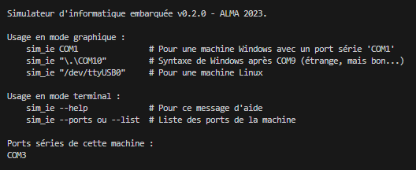
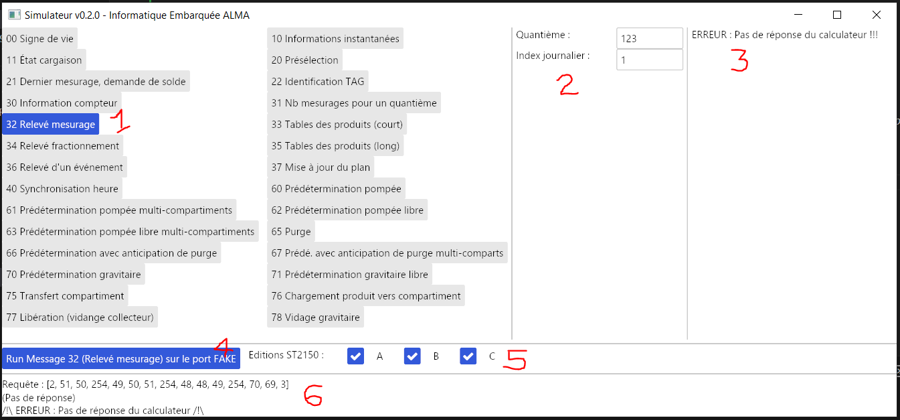

# SIM_IE

_Révision 0.2.0 du 16/09/2023_

Simulateur ALMA d'informatique embarquée.

Cet outil permet de simuler l'envoi de trame de requêtes et de décoder les trames de réponses avec un calculateur selon le protocole de l'informatique embarquée ST2150 via une liaison série de la machine hôte.

Les éditions du protocole ST2150 gérés par cet outil :

* Edition A historique
* Edition B de 2021 : liste produit étendue et TAG d'identification
* Edition C (préliminaire) de 2023 : Mode étendu

## Installation

Le fichier `sim_ie.exe` est suffisant. A copier sur la machine hôte.

## Exécution en mode console

En mode console (exécution depuis une ligne de commande), l'outil affiche les instructions d'utilisation et la liste des ports séries identifiés sur la machine hôte.



Pour utiliser l'outil en lien avec l'un des port séries de la machine hôte, le nom du port doit être un paramètre de la commande.

Par exemple, pour lancer l'outil pour une communication avec un calculateur distant connecté sur le port COM1 de la machine hôte :

```cmd
    sim_ie.exe COM1
```

Si le nom du port série spécifié est valide, l'interface graphique pour l'utilisateur apparaît.
Sinon, par exemple :

```
Erreur lors de l'ouverture du port 'COM2' : Le fichier spécifié est introuvable.
```

_Nota : Le port série nommé `FAKE` est toujours accepté par l'outil. Des requêtes seront alors possibles mais échoueront toujours en erreur pour cause d'absence de réponse du calculateur distant._

## Interface de l'outil



Dans cette interface, les zones de **1** à **6** (en rouge) ont pour usage :

* **zone 1** : Liste des requêtes possibles. Un filtrage de la liste est possible via **zone 5**. Cliquer ici sur la requête souhaitée

* **zone 2** : Champs à renseigner pour exécuter la requête sélectionnée en **zone 1**. **zone 4** ne permettra pas de lancer cette requête tant que tous les champs de **zone 2** ne sont pas renseignés

* **zone 3** : Valeurs des champs reçus dans la réponse du calculateur. **zone 3** peut également indiquer un problème détecté lors de l'envoi ou lors de la réception avec le calculateur distant

* **zone 4** : Bouton pour exécuter une vacation requête/réponse avec le calculateur distant. Ce bouton n'est pas actif s'il y a un ou plusieurs champs à renseigner dans **zone 2**

* **zone 5** : Un filtrage des requêtes par édition de la ST2150 est possible. La requête sélectionnée reste toujours visible dans **zone 1** même si elle ne répond pas à ce filtrage

* **zone 6** : Le détail du contenu de la requête effectuée et du contenu de la réponse reçue est affiché ici. Ces contenu sont affichés avec la valeur décimale de chaque octet des trames. La dernière erreur rencontrée apparaît également ici
